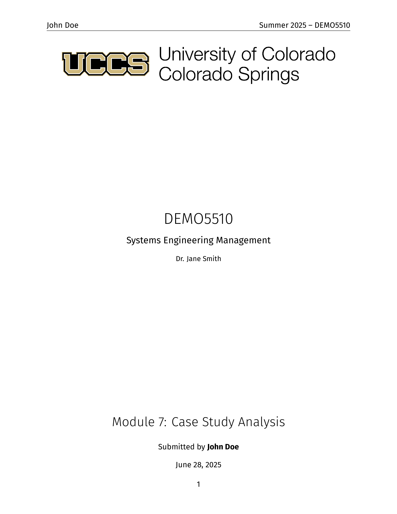
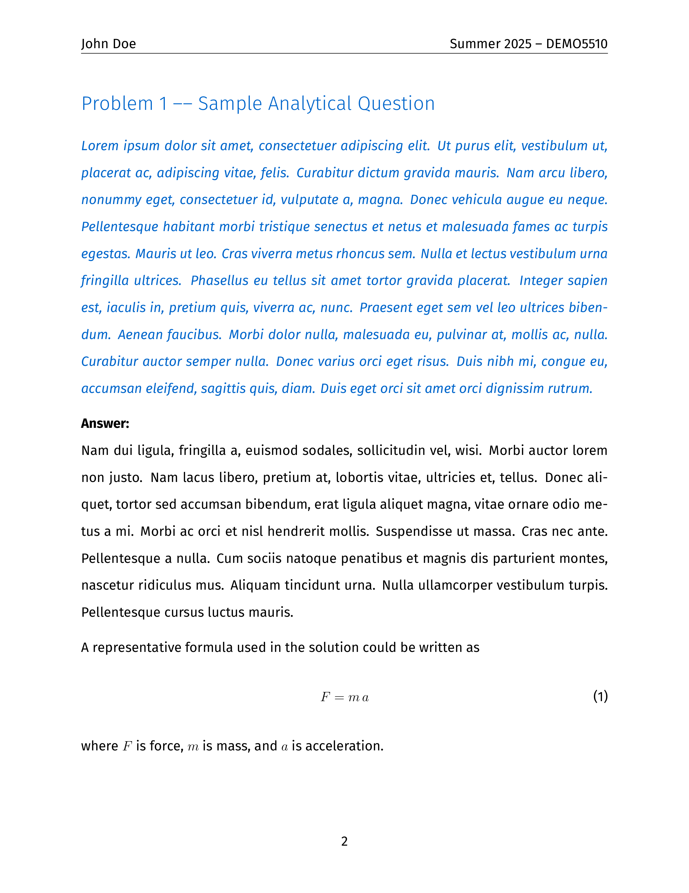
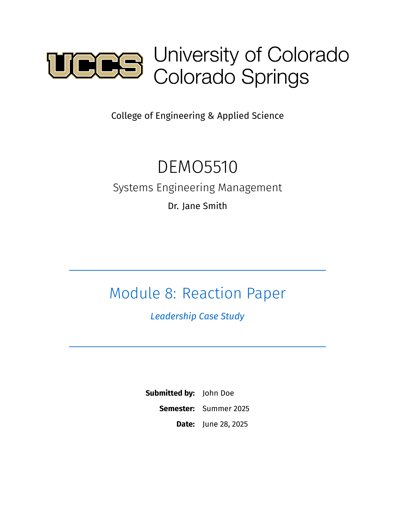
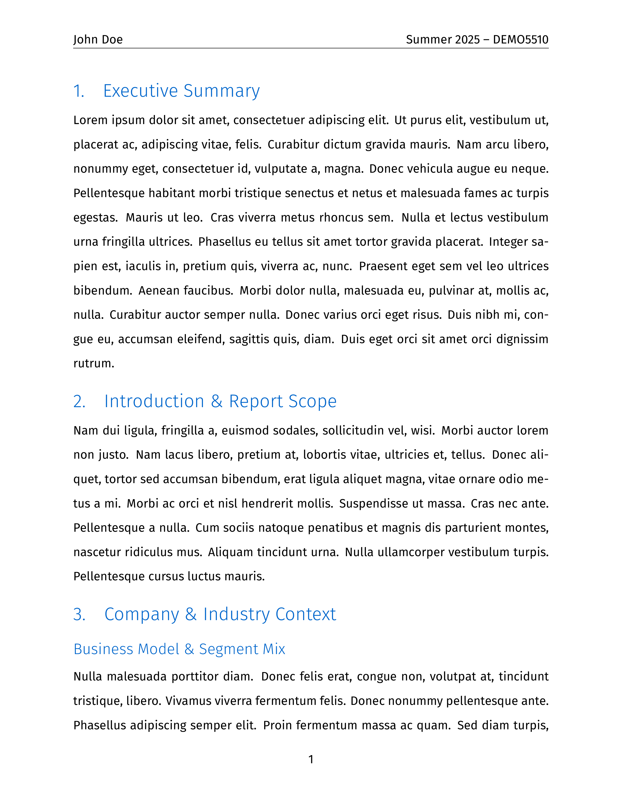

# UCCS LaTeX Coursework Toolchain

[](https://github.com/ddunnock/uccs-latex-templates/releases)
[](https://www.latex-project.org/)
[](https://fonts.google.com/specimen/Fira+Sans)
[](https://tectonic-typesetting.github.io/)

A comprehensive LaTeX document management system for **UCCS (University of Colorado Colorado Springs)** coursework, featuring automated document scaffolding, consistent branding, and streamlined compilation workflows.

> **Perfect for UCCS students** in Engineering, Business, Computer Science, and all academic programs requiring professional document preparation. Compatible with graduate and undergraduate coursework.

### 🎓 **Who Can Use This?**
- **UCCS Students**: All departments and programs (Engineering, Business, Sciences, Liberal Arts)
- **Other Universities**: Easily adaptable by replacing logos and color schemes
- **Professionals**: Technical reports, project documentation, and presentations
- **LaTeX Learners**: Well-documented examples and automation for beginners

## ✨ Features

- **🎯 Template-Based Document Generation**: Automated homework and report scaffolding with course-specific customization
- **🎨 Consistent UCCS Branding**: Professional styling with DoD-blue color scheme and Fira Sans typography
- **⚡ Multi-Engine Support**: Compatible with XeLaTeX, Tectonic, and LaTeX
- **📁 Organized Directory Structure**: Course/term-based file organization with shared assets
- **🛠️ Makefile Integration**: Streamlined build processes and workflow automation
- **🔤 Custom Font Integration**: Complete Fira Sans font family with proper XeLaTeX configuration

## 📖 Template Examples

The toolchain provides two professionally-styled templates designed for UCCS academic work. Both templates feature consistent branding, proper typography, and automated content generation.

### Homework Template

Optimized for assignments, problem sets, and take-home exams with a compact layout and mathematical typesetting support.

<div align="center">

**Title Page**



**Content Page**



</div>

**Key Features:**
- Compact title block with course information and assignment details
- Styled problem environments with DoD-blue highlighting
- Mathematical equation support with proper numbering
- Headers/footers on all pages for identification

### Report Template

Designed for formal reports, research papers, and capstone projects with a professional multi-page layout.

<div align="center">

**Title Page**



**Content Page**



</div>

**Key Features:**
- Dedicated title page with UCCS branding and course details
- Structured sections for executive summary, analysis, and recommendations
- Double-spaced formatting for academic standards
- Figure numbering and citation support
- Professional headers/footers throughout document

## 📂 Repository Structure

```
uccs-me-syse-latex/
├── build/                     # Build configuration and CI/CD
│   ├── Makefile              # Main build automation
│   ├── cicd/                 # Continuous integration
│   └── docker/               # Containerization support
├── classes/                  # Course-specific documents
│   └── EMGT5510/            # Course directory
│       └── 2025_summer/     # Term-specific assignments
│           ├── data/        # Supporting data files
│           ├── figures/     # Course-specific images
│           └── *.tex        # Generated documents
├── scripts/                  # Automation scripts
│   └── newdoc.sh            # Document scaffolding script
├── templates/                # LaTeX templates
│   ├── homework_template.tex # Homework assignment template
│   └── report_template.tex   # Report/project template
└── texmf/                    # Shared LaTeX resources
    ├── fonts/otf/           # Fira Sans font family
    └── images/              # Shared assets (UCCS logo, etc.)
```

## 🚀 Quick Start

### Prerequisites

- **XeLaTeX** (recommended) or **Tectonic** for compilation
- **Make** for build automation
- **Bash** for script execution

### Installation

1. **Clone the repository:**
   ```bash
   git clone https://github.com/ddunnock/uccs-latex-templates.git
   cd uccs-latex-templates
   ```

2. **Verify LaTeX engine:**
   ```bash
   # Check XeLaTeX installation
   which xelatex
   
   # Or check Tectonic installation
   which tectonic
   ```

### Creating Documents

#### Method 1: Using the Makefile (Recommended)

**Create a homework assignment:**
```bash
make newhw CLASS=EMGT5510 ACAD_TERM=2025_summer ASSIGN="Module-1_Homework" \
          STUDENT="Your Name" INSTRUCTOR="Dr. Instructor"
```

**Create a report:**
```bash
make newreport CLASS=EMGT5510 ACAD_TERM=2025_summer ASSIGN="Midterm_Report" \
               STUDENT="Your Name" INSTRUCTOR="Dr. Instructor" \
               COURSE_TITLE="Course Title"
```

#### Method 2: Direct Script Usage

**Environment variables:**
```bash
TYPE=homework CLASS=EMGT5510 ACAD_TERM=2025_summer ASSIGN="Module-1_Homework" \
STUDENT="Your Name" INSTRUCTOR="Dr. Instructor" \
COURSE_TITLE="Course Title" bash scripts/newdoc.sh
```

**Interactive mode:**
```bash
# Simple interactive mode
make newdoc

# Or run script directly
bash scripts/newdoc.sh

# Example interactive session:
# Document type [homework/report]: homework
# Course ID (e.g. EMGT5510): EMGT5510
# Academic term (e.g. 2025_summer): 2025_spring
# Assignment label (e.g. HW-01): Module-1_Homework
# Student name [Your Name]: John Smith
# Instructor [TBD]: Dr. Johnson
# Course title [optional]: Leadership for Engineers
```

### Compiling Documents

**Compile a single document:**
```bash
make pdf FILE=classes/EMGT5510/2025_summer/EMGT5510_Module-1_Homework.tex
```

**Compile all documents:**
```bash
make all
```

**Live compilation (watch mode):**
```bash
make watch FILE=classes/EMGT5510/2025_summer/EMGT5510_Module-1_Homework.tex
```

## 📝 Document Templates

### Homework Template Features
- **Compact Title Block**: Course info, assignment title, and submission details
- **Problem Environments**: Styled problem statements with DoD-blue highlighting
- **Mathematical Typesetting**: Full AMS-Math support with proper equation numbering
- **Sample Content**: Pre-filled example problems demonstrating best practices

### Report Template Features
- **Professional Title Page**: UCCS branding with course and project information
- **Structured Sections**: Executive summary, analysis, recommendations, and appendices
- **Academic Formatting**: Double-spaced body text with proper citation support
- **Figure Integration**: Section-numbered figures with caption support

## ⚙️ Makefile Commands

| Command | Description | Example |
|---------|-------------|----------|
| `help` | Show all available targets | `make help` |
| `pdf` | Compile single document | `make pdf FILE=path/to/doc.tex` |
| `all` | Compile all documents | `make all` |
| `watch` | Live compilation (latexmk) | `make watch FILE=path/to/doc.tex` |
| `clean` | Remove auxiliary files | `make clean` |
| `distclean` | Clean + remove PDFs | `make distclean` |
| `newdoc` | Interactive document creation | `make newdoc` |
| `newhw` | Create homework (shorthand) | `make newhw CLASS=EMGT5510 ...` |
| `newreport` | Create report (shorthand) | `make newreport CLASS=EMGT5510 ...` |

## 🎨 Styling and Branding

### Color Palette
- **Primary**: DoD Blue (`RGB(0,102,204)`) for headings and accents
- **Secondary**: Header Blue (`RGB(222,230,242)`) for table backgrounds
- **Text**: Black on white for optimal readability

### Typography
- **Body Text**: Fira Sans Regular/Bold/Italic
- **Headings**: Fira Sans Light for visual hierarchy
- **Math**: Computer Modern (LaTeX default) for mathematical expressions

### Document Standards
- **Margins**: 1 inch on all sides
- **Spacing**: Double-spaced body text
- **Headers**: Course and term information
- **Footers**: Page numbering

## 🔧 Configuration

### Personal Configuration File

Create a `.newdoc.conf` file in your project root or home directory to set default values for interactive mode:

```bash
# Copy the example and customize
cp .newdoc.conf.example .newdoc.conf

# Edit with your information
nano .newdoc.conf
```

**Example configuration:**
```bash
# Your personal information
STUDENT_NAME="John Smith"

# Current semester information  
ACAD_TERM="2025_spring"

# Current course information
CLASS="EMGT5510"
INSTRUCTOR="Dr. Johnson"
COURSE_TITLE="Leadership for Engineers"
```

**Benefits:**
- 🚀 **Faster document creation** - Just press Enter to use defaults
- 📝 **Consistent information** - No typos in repeated fields
- 🔄 **Easy semester updates** - Change term once per semester
- 👥 **Multiple courses** - Override CLASS per document as needed

### Engine Detection
The Makefile automatically detects available LaTeX engines in this order:
1. **Tectonic** (preferred for speed and reliability)
2. **XeLaTeX** (required for font support)
3. **Latexmk** (fallback with XeLaTeX backend)

### Font Configuration
Fira Sans fonts are included in `texmf/fonts/otf/` and automatically configured for XeLaTeX. The font paths are relative to the document location using the pattern `../../../texmf/fonts/otf/`.

### Asset Management
- **Shared Images**: Place in `texmf/images/` (UCCS logo, common figures)
- **Course-Specific**: Use `classes/COURSE/TERM/figures/` for assignment-specific images
- **Data Files**: Store in `classes/COURSE/TERM/data/` for datasets and supporting materials

## 🐛 Troubleshooting

### Common Issues

**Font not found errors:**
```bash
# Ensure you're compiling from the correct directory
cd classes/COURSE/TERM/
xelatex document.tex
```

**Graphics path errors:**
```bash
# Verify UCCS logo exists
ls ../../../texmf/images/uccs-logo.png
```

**Math mode errors with underscores:**
- The script automatically converts underscores in term names to spaces for display
- Use `2025_summer` as `ACAD_TERM` parameter

**Missing packages:**
```bash
# Install required LaTeX packages
tlmgr install fontspec titlesec fancyhdr geometry
```

### Build Verification

Test the system with a sample document:
```bash
# Create and compile a test homework
make newhw CLASS=TEST101 ACAD_TERM=2025_test ASSIGN="Test_Assignment" \
          STUDENT="Test Student" INSTRUCTOR="Test Instructor"

# Compile the test document
make pdf FILE=classes/TEST101/2025_test/TEST101_Test_Assignment.tex
```

## 🏫 **For UCCS Students**

### **Getting Started at UCCS**
- **Engineering Students**: Perfect for EMGT, SYSE, ME, EE, CS coursework
- **Business Students**: Professional reports and case study presentations  
- **Graduate Students**: Thesis, capstone projects, and research papers
- **All Departments**: Standardized formatting for any UCCS course

### **UCCS-Specific Features**
- ✅ **Official UCCS Logo** integrated and properly licensed
- ✅ **University Color Scheme** (DoD Blue matching UCCS branding)
- ✅ **Academic Year Support** (Fall/Spring/Summer terms)
- ✅ **Course Code Format** (DEPT#### automatic formatting)

### **Quick Start for UCCS Students**
```bash
# Clone and start your first assignment
git clone https://github.com/ddunnock/uccs-latex-templates.git
cd uccs-latex-templates

# Create your first homework (replace with your course)
make newhw CLASS=EMGT5510 ACAD_TERM=2025_spring ASSIGN="Assignment-1" \
          STUDENT="Your Name" INSTRUCTOR="Dr. LastName"
```

### **Adapting for Other Universities**
To customize for your institution:
1. Replace `texmf/images/uccs-logo.png` with your university logo
2. Update color scheme in templates (search for `dodblue`)
3. Modify header text and branding elements

## 🤝 Contributing

Contributions are welcome! Please:

1. **Fork** the repository
2. **Create** a feature branch (`git checkout -b feature/amazing-feature`)
3. **Commit** your changes (`git commit -m 'Add amazing feature'`)
4. **Push** to the branch (`git push origin feature/amazing-feature`)
5. **Open** a Pull Request

### Development Guidelines

- **Templates**: Follow existing styling patterns and placeholder conventions
- **Scripts**: Maintain POSIX shell compatibility where possible
- **Documentation**: Update README.md for any new features or changes
- **Testing**: Verify templates compile without warnings

## 📜 License

This project is licensed under the **MIT License** for all original source code, build scripts, and supporting files.

**Important**: The repository contains third-party assets with different licensing:
- **Fira Sans fonts**: Licensed under SIL Open Font License (OFL-1.1)
- **UCCS logo**: Trademark of University of Colorado (academic use only)

See the [LICENSE](LICENSE) file for complete details and compliance requirements.

## 🙏 Acknowledgments

- **UCCS College of Engineering & Applied Science** for branding guidelines
- **Fira Sans Font Family** by Mozilla for typography
- **LaTeX Community** for the robust typesetting foundation
- **Tectonic Project** for modern LaTeX compilation
